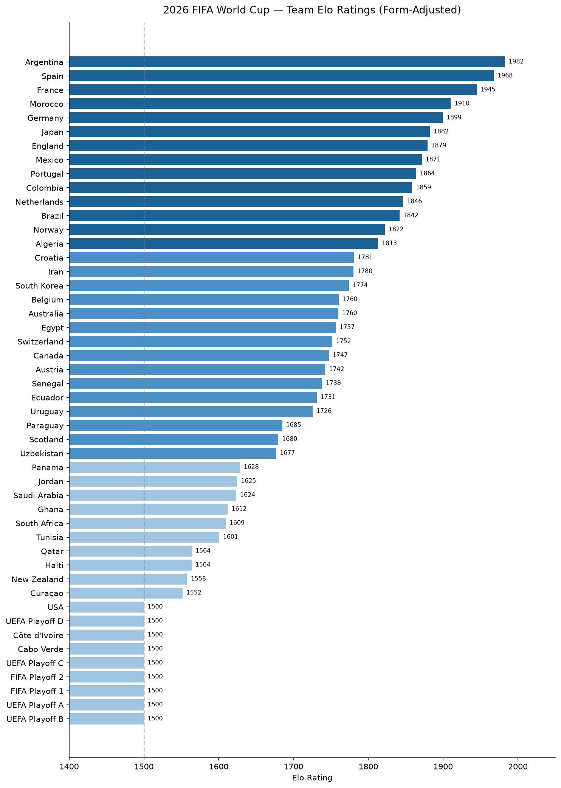
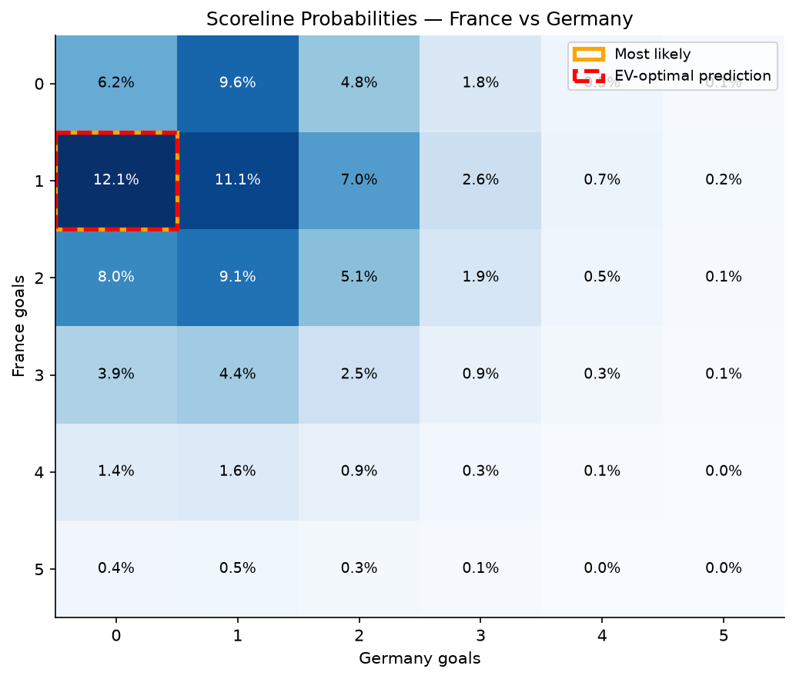
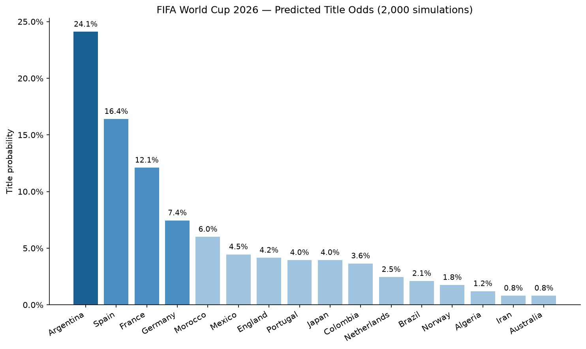

# FIFA World Cup 2026 Prediction Engine

Predicts all 104 matches of the 2026 FIFA World Cup from 49,477 historical international results, then simulates the tournament 10,000 times to get title odds.

---

## Key Findings
**Argentina wins the tournament in roughly 1 in 4 simulations (23%)** — the highest of any team, but far from a safe bet. Six other teams clear 4%.

| Team | Win the title | Reach the final | Reach the semi-final |
|---|---:|---:|---:|
| Argentina | ~23% | ~34% | ~49% |
| Spain | ~16% | ~27% | ~42% |
| France | ~12% | ~21% | ~35% |
| Germany | ~8% | ~16% | ~30% |
| Morocco | ~7% | ~13% | ~23% |
| England | ~4% | ~9% | ~19% |
| Portugal | ~4% | ~10% | ~21% |

Those odds reflect current form and Elo rating, not certainty — any of the top teams can win on the day, which is the point of simulating rather than just ranking.

For each of the 104 matches the model also outputs the scoreline that maximises expected competition points, the probability of a home win / draw / away win, and estimated corners and cards.

*(Table verified by re-running `fifa-predictor simulate --sims 10000 --seed 42`.)*

---

## Screenshots

**Elo ratings by team**


**Scoreline probability heatmap**


**Title odds — top 16**


More charts (goals-per-match trend, group-stage scoreline distribution, stage progression) are in `outputs/figures/` and generated live in `notebooks/fifa_prediction.ipynb`.

---

## Tech Stack
- **Python 3.10+**
- **pandas / numpy** — data loading and manipulation
- **scipy.stats** — Poisson distribution for scoreline probabilities
- **click** — command-line interface
- **matplotlib** — charts in the exploration notebook
- **pytest** — test suite (77 tests)
- **GitHub Actions** — runs the test suite on every push and pull request to `main`

---

## Methodology

**Step 1 — Team strength (Elo ratings)**
Every team gets a numerical strength score, updated after every international match since 2014. Beating a strong team moves your score up a lot. Losing to a weak team drops it significantly. World Cup matches count three times more than friendlies, because they are a better indicator of true team quality.

**Step 2 — Match forecast (Expected goals)**
The strength gap between two teams is converted into expected goals — how many goals each team would typically score against that opponent.

**Step 3 — Scoreline probabilities (Dixon-Coles Poisson model)**
Expected goals feed into a statistical model that calculates the probability of every possible scoreline: 0-0, 1-0, 2-1, and so on. A correction from Dixon & Coles (1997) fixes known errors that the standard model makes on low-scoring results.

**Step 4 — Best prediction (Expected value)**
Rather than simply predicting the most likely score, the model picks the scoreline that maximises expected competition points. These are often different — for example, predicting a 1-0 home win can earn more expected points than predicting a 1-1 draw, even if 1-1 is slightly more probable.

**Step 5 — Tournament simulation (Monte Carlo)**
The entire tournament — all 72 group matches and 32 knockout matches — is simulated 10,000 times. Each run samples random results weighted by their probabilities, so upsets happen naturally. The percentage of runs a team wins is their title probability.

See [docs/methodology.md](docs/methodology.md) for a detailed walkthrough of every modelling decision, including the reasoning behind each judgment call (K-factors, the 2014 start date, rho = 0.1, and so on).

---

## Project Structure
```
fifa-2026-predictor/
├── src/fifa_predictor/
│   ├── elo.py              # Team strength ratings from historical results
│   ├── poisson_model.py    # Scoreline probability model
│   ├── cards_corners.py    # Corners and cards estimates
│   ├── simulation.py       # Monte Carlo tournament simulator
│   ├── bracket.py          # Knockout bracket seeding logic
│   ├── scoring.py          # Competition points calculator
│   └── cli.py              # Command-line interface
├── data/raw/
│   ├── results.csv         # 49,000 historical international results
│   ├── group_fixtures.csv  # All 72 group-stage fixtures
│   └── knockout_slots.csv  # Knockout bracket structure
├── notebooks/
│   └── fifa_prediction.ipynb  # End-to-end walkthrough with charts
├── tests/                  # 77 automated tests
└── docs/methodology.md     # Full technical explanation
```

---

## How To Run
**Requirements:** Python 3.10+

```bash
git clone https://github.com/layaung-linnlett/fifa-2026-predictor.git
cd fifa-2026-predictor
pip install -e .
```

**Predict all 72 group-stage matches:**
```bash
python -m fifa_predictor predict-groups
```
Saves a CSV with predicted scores, win probabilities, and corners/cards for every match.

**Run the full tournament simulation:**
```bash
python -m fifa_predictor simulate --sims 10000
```
Simulates the entire World Cup 10,000 times and prints the title odds leaderboard.

**Predict the knockout bracket:**
```bash
python -m fifa_predictor predict-knockout
```
Finds the most likely bracket path and predicts every knockout match from Round of 32 to Final.

**Run the tests:**
```bash
pip install -e ".[test]"
python -m pytest tests/ -v
```
77 tests covering every module — from the Elo update formula to the full simulation pipeline.

**Run the notebook:**
```bash
pip install -e ".[notebook]"
jupyter notebook notebooks/fifa_prediction.ipynb
```

---

## Limitations & Future Work
- **Corners and cards are estimates.** The dataset only records goals, so these figures are based on each team's known playing style rather than measured statistics. Fitting this from real match-stats data would need a corners/cards dataset that isn't freely available in the same clean form as the goals data — worth revisiting if one turns up.
- **No injury or squad information.** The model assumes both teams play full strength. A key injury could significantly change the real probability.
- **Playoff teams are unknown.** Teams yet to qualify through playoffs are given an average rating. Ratings should be re-run once the playoff draws are confirmed.
- **No home advantage.** The tournament is hosted across the USA, Canada, and Mexico. No adjustment is made for local support.

---

## Contact

**La Yaung Linn Lett** — [github.com/layaung-linnlett](https://github.com/layaung-linnlett) · [linkedin.com/in/layaung-linnlett](https://www.linkedin.com/in/layaung-linnlett/)
